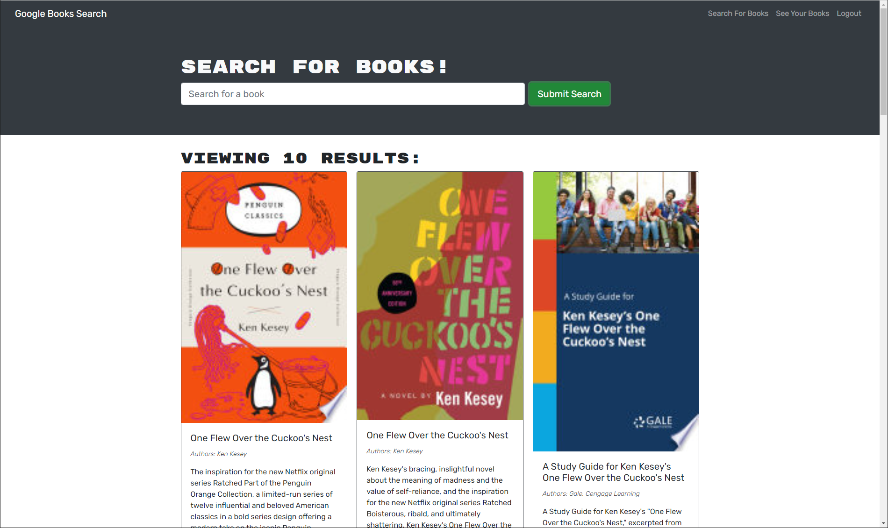

# Google Books Search

## Table of contents
​
- [Overview](#overview)
  - [The challenge](#the-challenge)
  - [User Story](#user-story)
  - [Acceptance Criteria](#acceptance-criteria)
  - [Screenshot](#screenshot)
  - [Links](#links)
- [My process](#my-process)
  - [Built with](#built-with)
  - [What I learned](#what-i-learned)
  - [Continued development](#continued-development)
  - [Useful resources](#useful-resources)
- [Author](#author)
​
​
## Overview
​
### The challenge
​
The Google Book search is a basic react app for searching books in Google's book API.  The user can save books to their account and easily find the link for the book in Google's book store.
​
### User Story
​
```md
AS AN avid reader
I WANT to search for new books to read
SO THAT I can keep a list of books to purchas
```
​
### Acceptance Criteria

```md
GIVEN a book search engine
WHEN I load the search engine
THEN I am presented with a menu with the options Search for Books and Login/Signup and an input field to search for books and a submit button
WHEN I click on the Search for Books menu option
THEN I am presented with an input field to search for books and a submit button
WHEN I am not logged in and enter a search term in the input field and click the submit button
THEN I am presented with several search results, each featuring a book’s title, author, description, image, and a link to that book on the Google Books site
WHEN I click on the Login/Signup menu option
THEN a modal appears on the screen with a toggle between the option to log in or sign up
WHEN the toggle is set to Signup
THEN I am presented with three inputs for a username, an email address, and a password, and a signup button
WHEN the toggle is set to Login
THEN I am presented with two inputs for an email address and a password and login button
WHEN I enter a valid email address and create a password and click on the signup button
THEN my user account is created and I am logged in to the site
WHEN I enter my account’s email address and password and click on the login button
THEN I the modal closes and I am logged in to the site
WHEN I am logged in to the site
THEN the menu options change to Search for Books, an option to see my saved books, and Logout
WHEN I am logged in and enter a search term in the input field and click the submit button
THEN I am presented with several search results, each featuring a book’s title, author, description, image, and a link to that book on the Google Books site and a button to save a book to my account
WHEN I click on the Save button on a book
THEN that book’s information is saved to my account
WHEN I click on the option to see my saved books
THEN I am presented with all of the books I have saved to my account, each featuring the book’s title, author, description, image, and a link to that book on the Google Books site and a button to remove a book from my account
WHEN I click on the Remove button on a book
THEN that book is deleted from my saved books list
WHEN I click on the Logout button
THEN I am logged out of the site and presented with a menu with the options Search for Books and Login/Signup and an input field to search for books and a submit button 
```

### Screenshot

<br>


​
### Links

- Live Website: [https://nolans-google-books.herokuapp.com/](https://nolans-google-books.herokuapp.com/)
<br>

## My process
​
### Built with

- React
- NoSQL
- Mongoose ODM
- NodeJS
- NPM Express
- Apollo Server
- GraphQL
​
### What I learned
​
This challenge required a refactor of a RESTful API backend and the frontend code attached to it into a stricly GraphQL application.  Some challenges that arrose were becoming familiar with the new hooks used in React components such as useQuery and useMutation.  In addition, the data structures that they return and how the naming of the their keys are determined from the query/mutation definitions.

### Continued development
​
In the future, I will use the skills I learned from this challenge to help me convert old applications into GraphQL ones.
​
### Useful resources
​
- [Apollo GraphQL Docs](https://www.apollographql.com/docs/apollo-server/data/resolvers) - The Apollo graphql docs were great at describing how to implement graphQL when using an Apollo server.

- [GraphQL Docs](https://graphql.org/learn/) - I found using the GraphQl docs very helpful to use in conjuction with the Apollo docs as well.

​
## Author
​
Nolan Spence
- Website - [Nolan Spence](https://unicorn-barf.github.io/Portfolio_Website_HTML_CSS/)
- Github - [https://github.com/Unicorn-Barf](https://github.com/Unicorn-Barf)
